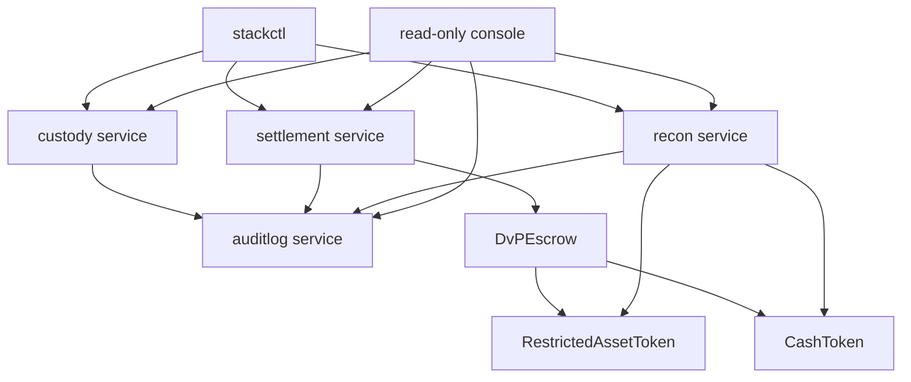
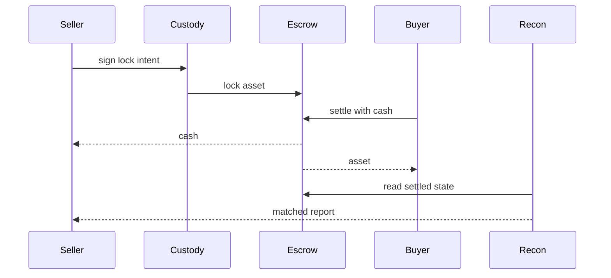
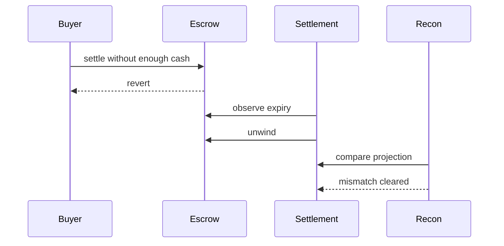
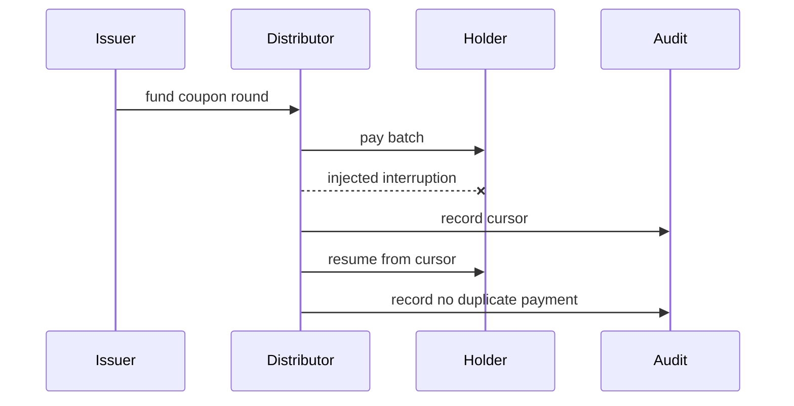

# Architecture

`tokenize-stack` is a local reference stack. The chain is the source of truth; service databases and reports are projections used to explain the flow.

## Components

## DvP Happy Path

## DvP Unwind

## Coupon Resume

## Trust Boundaries

- Demo keys are deterministic local keys only.
- The console is read-only.
- The audit verifier detects missing, edited, or reordered records in the JSONL chain.
- The local signer interface is the replacement point for real custody infrastructure.
