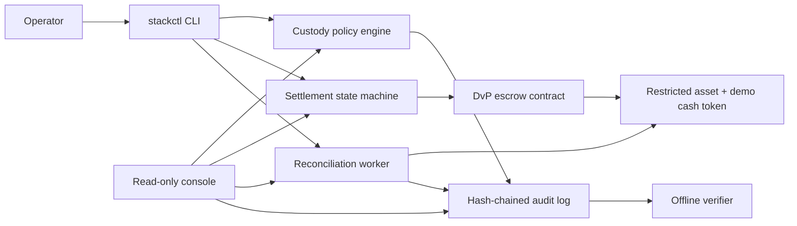

# tokenize-stack

[](https://github.com/vishnugovind10/tokenize-stack/actions/workflows/build.yml)
[](LICENSE)


Run a complete institutional tokenization reference stack locally in five minutes: restricted assets, custody policy enforcement, atomic DvP settlement, reconciliation, and a verifiable audit trail.


## Quickstart

```bash
git clone https://github.com/vishnugovind10/tokenize-stack.git
cd tokenize-stack
make demo
```

> Token-standard samples usually show contracts in isolation. The difficult wiring is custody policy, settlement failure handling, reconciliation, and audit evidence. This repository ships that wiring as a forkable template.

> [!CAUTION]
> Reference implementation for engineering study. Not audited. Not legal, investment, or production custody advice. Do not use it to safeguard real assets.



## What Is Inside

| Component | What it does | Where production diverges |
|---|---|---|
| `contracts/` | Restricted asset, registry, demo cash token, DvP escrow, coupon distributor | Audit, governance, upgrade planning, and deployment controls |
| `services/custody/` | Policy tiers, approvals, signer interface, local demo signer | Real key ceremonies, HSM/MPC integration, identity-bound approvals |
| `services/settlement/` | DvP orchestration and expiry unwind states | Multi-venue settlement, netting, richer fails handling |
| `services/recon/` | Chain/projection/audit comparison report | Counterparty statements, historical exception workflow |
| `services/auditlog/` | Append-only JSONL records with hash-chain verifier | Durable retention, independent publication, operator separation |
| `stackctl/` | Deterministic demo and failure runner | Production runbooks and access controls |
| `console/` | Read-only screen-recordable status surface | Authentication, roles, write actions |

## Failure Demos

`make demo-failures` runs three deterministic cases:

| Scenario | What appears | Final marker |
|---|---|---|
| Cash leg fails | A locked trade becomes mismatched, expires, then unwinds | `UNWIND: COMPLETE` |
| Restricted buyer | The restriction reason is surfaced as `NotAllowlisted` | `RESTRICTED: SURFACED` |
| Coupon interruption | A partial batch resumes from its cursor with no duplicate payment | `COUPON: NO DOUBLE PAYMENT` |

## Fork Guide

The template is designed around three seams:

| Seam | Local implementation | Replace with |
|---|---|---|
| `Signer` | Deterministic local dev key signer | HSM, MPC, or wallet policy backend |
| `CashToken` | Mock EUR cash token | Tokenized deposit, e-money, or sandbox payment rail |
| `ComplianceRegistry` | Allowlist, pause, and lockup mechanics | Your eligibility and transfer-control source |

Keep the interfaces stable and replace one seam at a time. The local demo remains useful as a regression harness after each replacement.

## Commands

```bash
make demo
make demo-failures
make test
make lint
make verify-audit
```

`make demo` prints:

```text
RECON: ALL MATCHED
AUDIT: CHAIN INTACT
```

`make demo-failures` prints:

```text
UNWIND: COMPLETE
RESTRICTED: SURFACED
COUPON: NO DOUBLE PAYMENT
AUDIT: CHAIN INTACT
```

## Implementation Status

| Surface | Status | Evidence |
|---|---|---|
| Deterministic lifecycle runner | Implemented | `make demo` |
| Failure-path runner | Implemented | `make demo-failures` |
| Audit tamper detection | Implemented | `tests/test_auditlog.py` |
| Custody policy evaluation | Implemented | `tests/test_policy.py` |
| Reconciliation report | Implemented | `tests/test_scenarios.py` |
| Solidity contracts | Reference code | Foundry project under `contracts/` |
| HTTP services | Minimal reference apps | FastAPI entry points under `services/` |
| Template distribution | Manual setting required after first publish | GitHub repository setting |

## Repository Map

- `stackctl/`: deterministic lifecycle runner, scenario engine, and CLI.
- `services/common/`: shared models, audit writer, and in-memory ledger.
- `services/auditlog/`: append-only audit ingest and offline verifier.
- `services/custody/`: policy engine, approval queue, and signer interface.
- `services/settlement/`: trade state transitions and unwind handling.
- `services/recon/`: three-way report generation.
- `contracts/`: Solidity reference contracts and Foundry tests.
- `console/`: read-only status UI.
- `scenarios/`: declarative happy-path and failure-path scripts.

## Development

```bash
python -m pip install -e ".[dev]"
pytest
python -m stackctl demo
python -m stackctl demo-failures
```

See [ARCHITECTURE.md](ARCHITECTURE.md), [LIMITATIONS.md](LIMITATIONS.md), [ROADMAP.md](ROADMAP.md), and [SECURITY.md](SECURITY.md).

## Citing This Work

Use [CITATION.cff](CITATION.cff) or GitHub's **Cite this repository** button. The citation describes a reference implementation and does not imply audit assurance, production readiness, or deployment certification.

## Author

Vishnu Govind - [GitHub](https://github.com/vishnugovind10) | [Medium](https://medium.com/@vishnugovind10) | [LinkedIn](https://www.linkedin.com/in/vishnu-govind)

MIT licensed.
